# 机器学习——性能评估方法(1)

对学习器的泛化性能进行评估，不仅需要有效可行的实验估计方法，还需要有衡量模型泛化能力的评价标准，这就是性能度量(performance measure).本节主要包含：查准率、查全率、F1、ROC、AUC以及代价敏感错误率曲线。
> ——周志华老师机器学习西瓜书的一些总结与备忘。

<!-- more -->

## 2.3.2 查准率、查全率与F1

对于二分类问题，可将样例根据其真实类别与学习器预测类别的组合划分为真正例(true positive) 、假正例 (false positive) 、真反倒(true negative)、假反例 (false negative) 四种情形。用TP 、FP 、TN 、FN 表示。

<table> <tr> <th rowspan="2">真实情况</th> <th colspan="2">预测结果</th> </tr> <tr> <td>正例</td> <td>反例</td> </tr> <tr> <td>正例</td> <td>TP(真正例)</td> <td>FN(假反例)</td> </tr> <tr> <td>反例</td> <td>FP(假正例)</td> <td>TN(真反例)</td> </tr> </table>
---------------------
查准率 P与查全率 R 分别定义：
$$
P=\frac{TP}{TP+FP}
$$

$$
R = \frac{TP}{TP+FN}
$$


+ 若一个学 习器的 P-R 曲线被另一个学习器的曲线完全包住， 则可断言后者的性能优于前者。

+ 如发生交叉，则一般难以断言孰优孰劣，只能在具体的查全与查准率下比较。

+ “平衡点”（Break-Event Point ,**BEP**）图中斜线就是一个比较模型优劣的度量方法。

+ F1度量（更常用）：
  $$
  F1 = \frac{2\times P\times R}{P+R}=\frac{2\times TP}{样例总数+TP-TN}=\frac{2\times TP}{FP+FN+2\times TP}
  $$
  *F1* 是基于查准率与查全率的**调和平均** *(harinonicmean)*定义的: 
  $$
  \frac{1}{F1}=\frac{1}{2}(\frac{1}{R}+\frac{1}{P})
  $$
   然而在一些应用中，对查准率和查全率的重视程度有所不同.例如在商品推荐系统中，为了尽可能少打扰用户，更希望推荐内容确是用户感兴的，此时查准率更重要;而在逃犯信息检索系统中，更希望尽可能少漏掉逃犯，此时查全率更重要。
  $F _\beta$ 是基于查准率与查全率的**加权调和平均**：
  $$
  F_\beta = \frac{(1+\beta^2)\times P \times R}{(\beta^2\times P)+R}
  $$
  $\beta>0$度量查全与查准的相对重要性。$\beta>1$时**查全率**有更大影响，$\beta<1$**查准率**有更大影响。

  有多个混淆矩阵时（比如多次测试，或者多分类任务中两两类别都有一个混淆矩阵）：

  （1）各混淆矩阵上分别计算出查准率和查全率，记为 (P1， R1 ) ... (Pn ， Rn) ， 再计算平均值，这样就得到"宏查准率" (macro-P) 、 "宏查全率" (macro-R) ，以及相应的"宏F1" (macro-F1).

  ​                            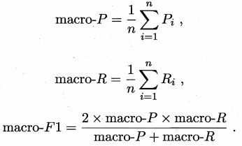

   （2）还可先将各泪淆矩阵的对应元素进行平均，得到 TP 、 FP 、 TN 、 FN 的平均值，再基于这些平均值计算出"微查准率 "(microo-P) 、 "徽查全率"(micro-R)和"微F1" (micro-F1):

  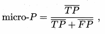

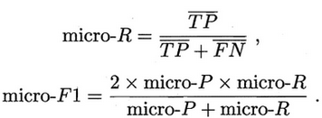

## 2.3.3 ROC 与 AUC 

### ROC(Receiver Operating Characteristic)  

​        很多学习器是为测试样本产生一个实值或概率预测，然后将这个预测值与一个分类阔值(threshold)进行比较，若大于阈值则分为正类，否则为反类.例如，神经网络在一般情形下是对每个测试样本预测出一个 [0.0 ，1.0] 之间的实值，然后将这个值与 0.5 进行比较，大于 0.5 则判为正例，否则为反例. 

+ ROC曲线绘制方法：根据概率预测结果，将测试样本进行排序，"最可能"是正例的排在最前面，"最不可能"是正例的排在最后面。分类过程就相当于在这个排序中以某个"**==截断点==**" (cut point)将样本分为两部分，前一部分判作正例，后一部分则判作反例. 

+ ROC 曲线的纵轴是"真正例率" (True Positive Rate，简称 ***==TPR==***)，横轴是"假正例率" (False PositiveRate，简称 ***==FPR==***)  

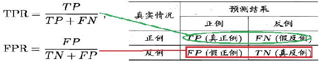

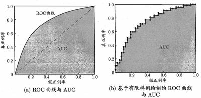

+ 绘图过程很简单:给定 m+ 个正例和m一 个反例。

  + 根据学习器预测结果对样例进行排序，把分类阔值设为最大，即把所有样例均预测为反例，此时真正例率和假正例率均为 0 ， 在坐标 (0， 0) 处标记一个点

  + 将分类阐值依次设为每个样例的预测值，即依次将每个样例划分为正例.设前一个标记点坐标为 (x， y) 。

    + 当前若为真正例，则对应标记点的坐标为 $$(x,y+\frac{1}{m^+})$$;当前若为假正例，则对应标记点的坐标为$$(x+\frac{1}{m^-},y)$$ ，然后用线段连接相邻点即可。

    + 当出现a个正例与b个反例的预测值大小相等的情况下，则对应的坐标变为$$(x+\frac{b}{m^-},y+\frac{a}{m^+})$$，为一斜线段。

### AUC (Area Under ROC Curve)

AUC 可通过对ROC曲线下各部分的面积求和而得。

+ 估算公式为：$记ROC曲线由｛(x_1,y_1),(x_2,y_2),\dots(x_n,y_n)｝$连接而成。则:

  $$AUC=\frac{1}{2}\sum_{i=1}^{m-1}(x_{i+1}-x_i)(y_i+y_{i+1})$$

AUC 考虑的是样本预测的排序质量，因此它与排序误差有紧密联系.给定 $m^+$个正例和 $m^-$个反例.令 $D^+$ 和 $D^-$分别表示正、反例集合，则排序"损失" (loss)定义为:

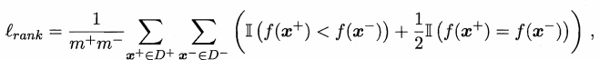

$l_{rank}$ 对应的是 ROC 曲线之上的面积。关于这点，可以参考博文：

[](https://blog.csdn.net/icefire_tyh/article/details/52065867)

其中对该问题做了较为详细的论述：

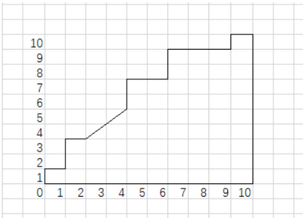

+ 从上ROC图中可以看出，折线每次向右(右上)延伸，表示扫描到了反例，折线上方对应的面积，就是该反例后面有多少个正例，每个正例是一个正方形，对应的面积是1。同位置上的正例是个三角形，对应的面积是0.5。最后再除以一个归一化系数。因此有：$AUC = 1-l_{rank}$

  #### 编程实践：绘制ROC曲线以及计算AUC值通用程序

  ```python
  import numpy as np
  import matplotlib.pyplot as plt
      
  def ROCandAUC(predits,labels):
      if len(predits) != len(labels):
          raise 'Predits and Labels Length Error !'
      POSITIVE = sum(labels)          #正例样本数
      NEGITIVE = len(labels)-POSITIVE #反例样本数
      zipped = list(zip(predits,labels))
      zipped.sort(reverse=False,key=lambda x:x[0]) #按输出值大小排序
      AUC = 0
      draw_point_x = [0]
      draw_point_y = [0]
      positive_num = 0
      negative_num = 0
      #按顺序设置cut-point，遇到正例向上画线，反例向右画线
      while len(zipped)!=0:
          max_predit = zipped[-1][0]
          while len(zipped)!=0:
              if zipped[-1][0]==max_predit:
                  if zipped[-1][1]==1:
                      positive_num += 1
                  else:
                      negative_num += 1
                  zipped.pop(-1)
              else:
                  break
          draw_point_y.append(positive_num/POSITIVE) 
          draw_point_x.append(negative_num/NEGITIVE)
          #计算AUC值
          AUC += 0.5*(draw_point_x[-1]-draw_point_x[-2])*(draw_point_y[-1]+draw_point_y[-2])
  	#绘制曲线
      plt.plot(draw_point_x,draw_point_y)
      plt.show()
      return AUC
  ```

  测试：

  ```python
  pre = [0.9,0.89,0.8,0.8,0.79,0.79,0.78,0.78,0.7,0.7,0.6,0.6,0.5,0.5,0.4,0.4,0.4,0.3,0.2]
  label = [1,0,1,1,1,0,1,0,1,1,0,0,1,1,0,0,0,1,0]
  auc = ROCandAUC(pre,label)
  print(auc)
  ```

  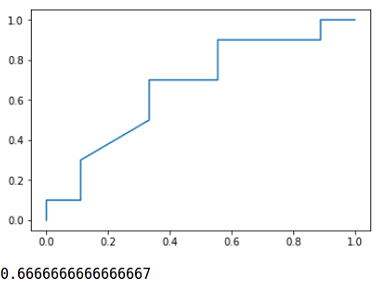

## 2.3.4代价敏感错误率与代价曲线 

简而言之就是把FP以及FN的情况在计算损失时赋予了一定权重，来不同程度的惩罚相应类型的错误。

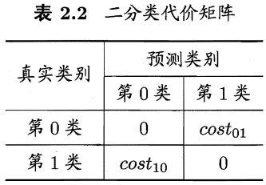

+ 实际在意的是$cost_{01}与cost_{10}$的**比值**而非绝对值。

+ "**代价敏感**" (cost-sensitive)错误率为：

  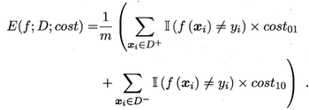

+ i、 j 取值不限于0 、 1 ，则可定义出多分类任务的代价敏感性能度量.

+ 在非均等代价下， ROC 曲线不能直接反映出学习器的期望总体代价 需要引入"**代价曲线**" (cost curve) .其x轴为P(+)cost, y轴为归一化cost:

  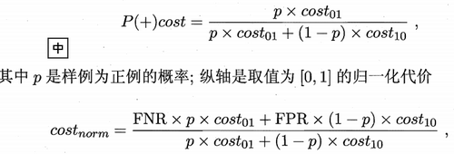

+ 其中（FNR = 1 - TPR ）。事实上，对于给定样本集（p确定）以及代价$cost_{01}与cost_{10}$，$P(+)_{cost}$可以写为$P(+)_{cost}=\frac{a}{a+b},其中a= p\times cost_{01},b=(1-p)\times cost_{10}$的形式。则有：

​        $$cost_{norm}=(FNR-FPR)\times P(+)_{cost} + FPR$$

​       因此代价曲线的斜率即为$FNR-FPR$。

+ 绘制: ROC 由线上每点对应了代价平面上的一条线段 

+ 设 ROC 曲线上点的坐标为 (TPR， FPR) ，则可相应计算出 FNR，然后在代价平面上绘制一条从 (0， FPR) 到 (1， FNR) 的线段

+ 线段下的面积即表示了该条件下的期望总体代价;如此将 ROC 曲线土的每个点转化为代价平面上的一条线段，然后取所有线段的下界，围成的面积即为在所有条件下学习器的期望总体代价。

  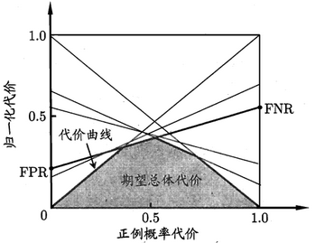